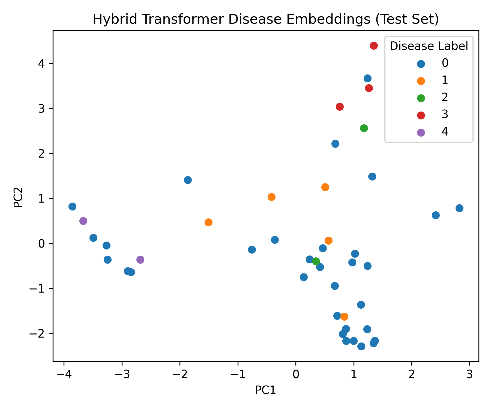
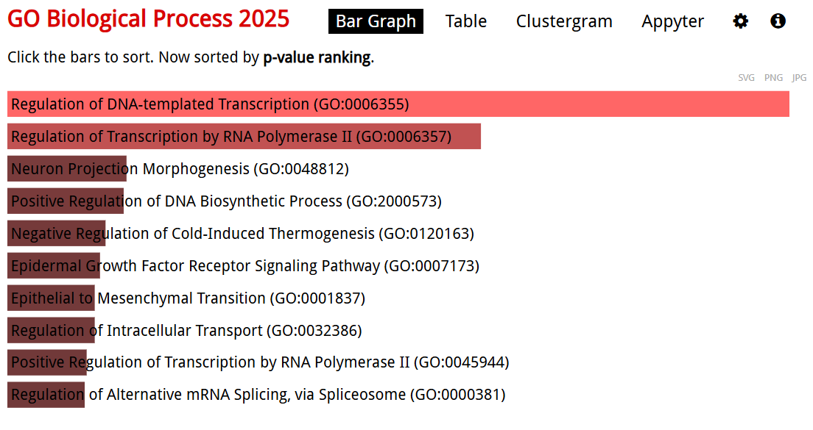
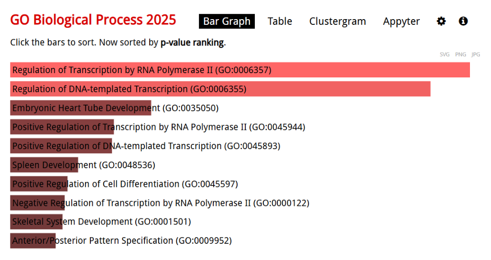
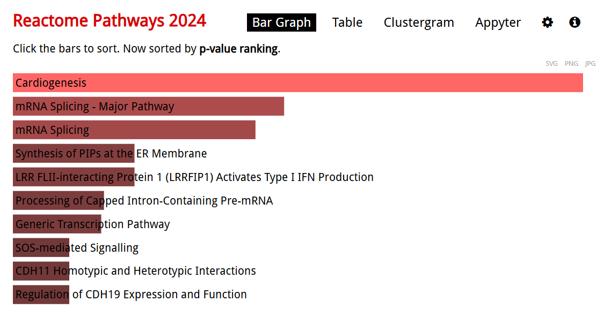

# Multi-Disease Gene Signature Analysis in Neurological Disorders Using AI

An AI-based transcriptomic analysis pipeline for multi-class classification and identification of shared and disease-specific gene signatures across neurological disorders.

## Project Overview

This project integrates gene expression datasets from four neurological disorders and healthy controls to investigate common and disease-specific transcriptomic patterns.

The analysis combines classical machine learning models with a custom Hybrid Transformer architecture. Classical models were used as baseline classifiers, while the Transformer was used to generate learned representations and support downstream gene-importance and disease-similarity analysis.

### Diseases Studied

- Alzheimer's Disease (AD)
- Parkinson's Disease (PD)
- Huntington's Disease (HD)
- Multiple Sclerosis (MS)
- Healthy Control

## Objectives

- Integrate gene expression datasets from multiple neurological disorders.
- Harmonize gene identifiers across heterogeneous datasets.
- Construct a common gene-expression feature space.
- Evaluate classical machine learning approaches for multi-class classification.
- Develop a Hybrid Transformer model for gene expression analysis.
- Generate sample embeddings and analyze disease similarity.
- Identify shared and disease-specific gene signatures.
- Perform pathway enrichment and gene-pathway network analysis.

---

## Datasets

The datasets were obtained from the **NCBI Gene Expression Omnibus (GEO)**.

| Disease | GEO Accession |
|---|---|
| Alzheimer's Disease | GSE48350 |
| Parkinson's Disease | GSE168496 |
| Huntington's Disease | GSE64810 |
| Multiple Sclerosis | GSE21942 |

The datasets were processed into a common gene-symbol representation to enable cross-disease comparison.

After harmonization and intersection, the integrated feature space contained approximately **14,000+ common genes**.

### Class Labels

| Label | Disease |
|---:|---|
| 0 | Control |
| 1 | Alzheimer's Disease |
| 2 | Parkinson's Disease |
| 3 | Huntington's Disease |
| 4 | Multiple Sclerosis |

---

## Workflow

```text
GEO Dataset Collection
        ↓
Gene Expression Preprocessing
        ↓
Log2 Transformation
        ↓
Gene Identifier Harmonization
        ↓
Duplicate Gene Handling
        ↓
Gene Filtering
        ↓
Common Gene Intersection
        ↓
Z-score Normalization
        ↓
Multi-disease Dataset Assembly
        ↓
Train / Validation / Test Split
        ↓
Classical ML Baselines
        ↓
Feature Selection
        ↓
Hybrid Transformer
        ↓
Embeddings + Gene Importance
        ↓
Similarity & Clustering Analysis
        ↓
Pathway Enrichment
        ↓
Shared & Disease-specific Gene Signatures

```
---

## Classical Machine Learning

Classical machine learning models were implemented as baseline approaches for multi-class disease classification.

### Models

- Logistic Regression
- Support Vector Machine (SVM)

### Model Performance

The final models were evaluated using validation accuracy, test accuracy, and test Macro-F1 score.

| Model | Validation Accuracy | Test Accuracy | Macro-F1 (Test) |
|---|---:|---:|---:|
| Logistic Regression | 0.814 | **0.909** | **0.699** |
| SVM (Linear) | **0.837** | 0.864 | 0.630 |
| Hybrid Transformer | 0.767 | 0.705 | 0.165 |

Logistic Regression achieved the highest test accuracy and test Macro-F1, while SVM achieved the highest validation accuracy.

The Hybrid Transformer showed lower classification performance than the classical models, but its learned representations were further used for embedding analysis, disease similarity, clustering, and gene-importance analysis.

Features identified by the classical models were used to construct the reduced gene set for the subsequent Transformer analysis.

---

## Results & Visualizations

### Transformer Embedding Analysis

The Hybrid Transformer test-set embeddings were visualized using PCA to examine the representation of samples across the five disease classes.



The disease labels correspond to Control (0), Alzheimer's disease (1), Parkinson's disease (2), Huntington's disease (3), and Multiple Sclerosis (4).

### Gene Enrichment Analysis

Gene Ontology enrichment analysis was performed to investigate biological processes associated with genes identified during the machine learning and Transformer analyses.

#### ML-identified Genes

The enrichment analysis of genes identified through the classical machine learning workflow highlighted biological processes related to neuronal structure, signaling, transcriptional regulation, and intracellular transport.



#### Transformer-identified Genes

GO enrichment analysis of Transformer-identified genes highlighted transcriptional regulation, developmental processes, and regulatory mechanisms.



### Reactome Pathway Enrichment

Reactome-based enrichment analysis was also used to examine pathway-level patterns among the identified genes.


## Hybrid Transformer

A custom Hybrid Transformer model was implemented using PyTorch.

The model combines two representations of gene expression:

### Numerical representation

Continuous standardized gene-expression values are projected into an embedding space.

### Gene-state representation

Expression values are discretized into three states:

- `0` — normal
- `1` — down-regulated
- `2` — up-regulated

The numerical and token embeddings are combined before being passed through Transformer encoder layers.

### Model configuration

- Embedding dimension: 64
- Attention heads: 4
- Transformer encoder layers: 2
- Output classes: 5
- Batch size: 16
- Optimizer: Adam
- Learning rate: `1e-3`
- Loss function: Cross-Entropy Loss

The implementation was developed in Python using PyTorch and executed using Google Colab.

---

## Embedding and Similarity Analysis

The Transformer was used to generate learned representations of the gene-expression samples.

### PCA

Principal Component Analysis (PCA) was applied to the Transformer-derived embeddings to visualize patterns across the disease classes.

### Cross-Disease Similarity

Cosine similarity was used to compare disease-level representations and investigate relationships between the neurological disorders.

### Hierarchical Clustering

Hierarchical clustering was applied to the disease representations to visualize similarities and differences between disease groups.

---

## Gene Importance Analysis

Gene importance was calculated using an activation-based approach derived from the Transformer encoder outputs.

Mean absolute activation values were calculated across embedding dimensions and samples to obtain an importance score for each selected gene.

The resulting scores were ranked to identify genes contributing strongly to the learned representations.

Example output:

`transformer_gene_importance_activation_based.csv`

---

## Pathway and Network Analysis

Top-ranked genes were further analyzed for biological interpretation using pathway enrichment and gene–pathway network analysis.

The analysis highlighted biological processes involving:

- Neuronal signalling
- Immune response
- Transcriptional regulation
- Cellular stress response

A gene–pathway network was also constructed to visualize relationships between important genes and enriched biological pathways.

---

## Shared and Disease-Specific Gene Signatures

The analysis identified candidate gene signatures that were either shared across multiple neurological disorders or associated more strongly with individual diseases.

These signatures were used to investigate common molecular mechanisms as well as disease-specific transcriptomic patterns.

The identified genes should be considered **computationally derived candidate signatures** and not experimentally validated biomarkers.

---

## Key Observations

The downstream analyses indicated several broad transcriptomic patterns:

- Alzheimer's Disease and Parkinson's Disease showed greater molecular similarity in the analyzed representations.
- Huntington's Disease displayed intermediate characteristics.
- Multiple Sclerosis showed more distinct patterns associated with immune-related mechanisms.
- Shared gene signatures suggested common molecular processes across neurological disorders.
- Disease-specific signatures highlighted molecular differences between disorders.

These observations are based on the analyzed datasets and computational results.

---

## Technologies Used

### Programming & Machine Learning

- Python
- Pandas
- NumPy
- Scikit-learn
- PyTorch

### Visualization & Analysis

- Matplotlib
- Seaborn
- PCA
- Cosine Similarity
- Hierarchical Clustering

### Bioinformatics

- NCBI Gene Expression Omnibus (GEO)
- Gene expression analysis
- Gene identifier harmonization
- Pathway enrichment
- Gene–pathway network analysis

### Development Environment

- Google Colab
- Jupyter Notebook

---

## Repository Structure

```text
neurological-disorders-classification/
│
├── 📁 figures/
│   ├── hybrid_transformer_pca.png
│   ├── ml_go_enrichment.png
│   ├── ml_reactome_enrichment.png
│   └── transformer_go_enrichment.png
│
├── 📁 notebooks/
│   ├── 01_preprocessing_&_normalization.ipynb
│   ├── 02_ID_harmonization_&_common_genes.ipynb
│   ├── 03_dataset_assembly.ipynb
│   ├── 04_ML_Baseline.ipynb
│   ├── 05_hybrid_transformer.ipynb
│   └── transformer_analysis_and_visualization.ipynb
│
├── 📁 results/
│   ├── AD_specific_genes.csv
│   ├── HD_specific_genes.csv
│   ├── MS_specific_genes.csv
│   ├── PD_specific_genes.csv
│   ├── shared_gene_signature.csv
│   ├── final_gene_signatures_all_annotated_v2.csv
│   └── transformer_gene_importance_activation_based.csv
│
├── 📄 .gitignore
└── 📄 README.md

```

## Reproducibility

The project was developed and executed in Python using Google Colab.

The notebooks document the major stages of the analysis:

1. Data preprocessing and normalization
2. Gene identifier harmonization
3. Common-gene identification
4. Dataset assembly
5. Classical machine learning
6. Hybrid Transformer modelling
7. Embedding analysis
8. Gene importance analysis
9. Biological interpretation

The original gene-expression datasets are publicly available through NCBI GEO using the accession numbers listed in the dataset section.

---

## Limitations

- The study uses publicly available datasets with differences in experimental design and data characteristics.
- The number of samples is relatively small compared with the number of gene features.
- The identified gene signatures are computationally derived and were not experimentally validated.
- Further validation using independent datasets would strengthen the findings.
- Experimental and clinical validation would be required before considering the identified signatures for diagnostic or therapeutic applications.

---

## Future Work

Potential extensions of the project include:

- Validation using larger independent datasets
- Application of pretrained genomic models
- Integration of additional omics data
- Improved model interpretability
- Experimental validation of candidate gene signatures
- Further investigation of disease-associated molecular pathways

---

## Project Context

This project was completed as a major undergraduate project for the **B.Sc. Bioinformatics and Data Science** program at **Sathyabama Institute of Science and Technology**.

The project focuses on applying machine learning, deep learning, and transcriptomic analysis to investigate shared and disease-specific molecular patterns across neurological disorders.
